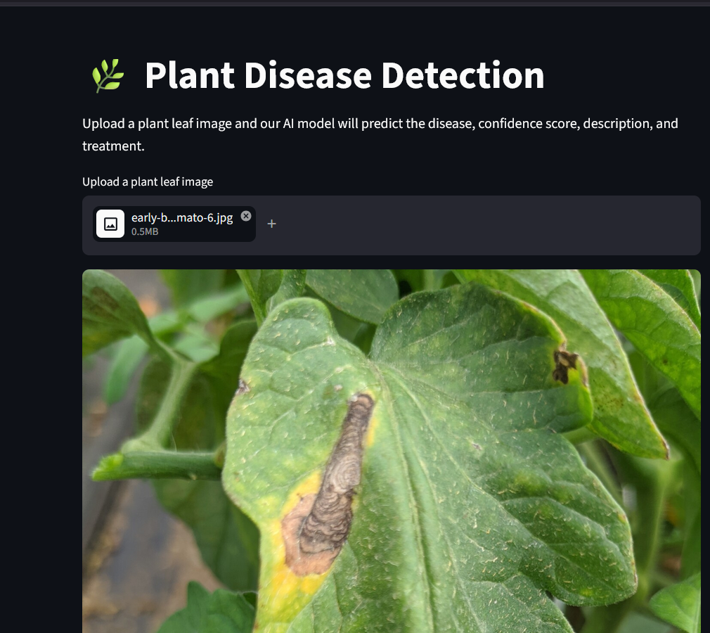
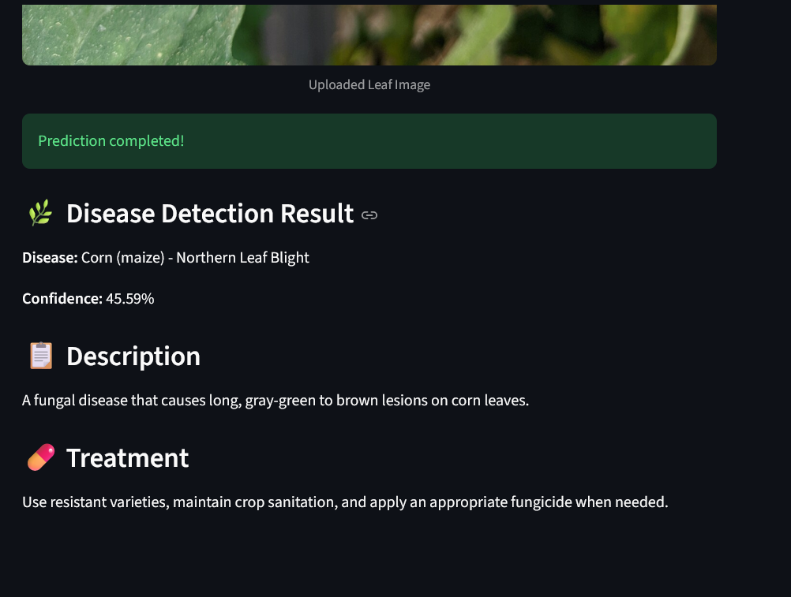

# 🌿 Plant Disease Detection Using Deep Learning

An AI-powered plant disease detection application built using Convolutional Neural Networks (CNN), TensorFlow, and Streamlit.

## 📌 About the Project

This project aims to help identify plant diseases from leaf images using deep learning. Users can upload a leaf image and receive a predicted disease label, confidence score, disease description, and suggested treatment information.

## ✨ Key Features

- Plant leaf image upload
- Deep learning-based disease classification
- Prediction confidence score
- Disease descriptions and treatment suggestions
- Interactive Streamlit web application

## 🛠️ Technologies Used

- Python
- TensorFlow / Keras
- Convolutional Neural Networks (CNN)
- NumPy
- Streamlit
- Pillow

## 🧠 Model Overview

- Model architecture: CNN
- Input image size: 128 × 128 pixels
- Classification categories: 38
- Dataset: PlantVillage
- Task: Multi-class plant disease image classification

## 🎯 Project Goal

To explore how deep learning can support early plant disease identification and provide accessible, AI-assisted information for plant care.

## ⚠️ Disclaimer

Model predictions are estimates and may be incorrect for some images. Treatment information is for general guidance only; consult an agricultural expert for reliable diagnosis and treatment.

## 👩‍💻 Author

**Minahil Aslam**

Artificial Intelligence | Machine Learning | Deep Learning

## 📸 Application Screenshots

### 🌿 Plant Disease Detection App

### 🔍 Disease Prediction Result

### 🍃 Uploaded Plant Leaf Image

